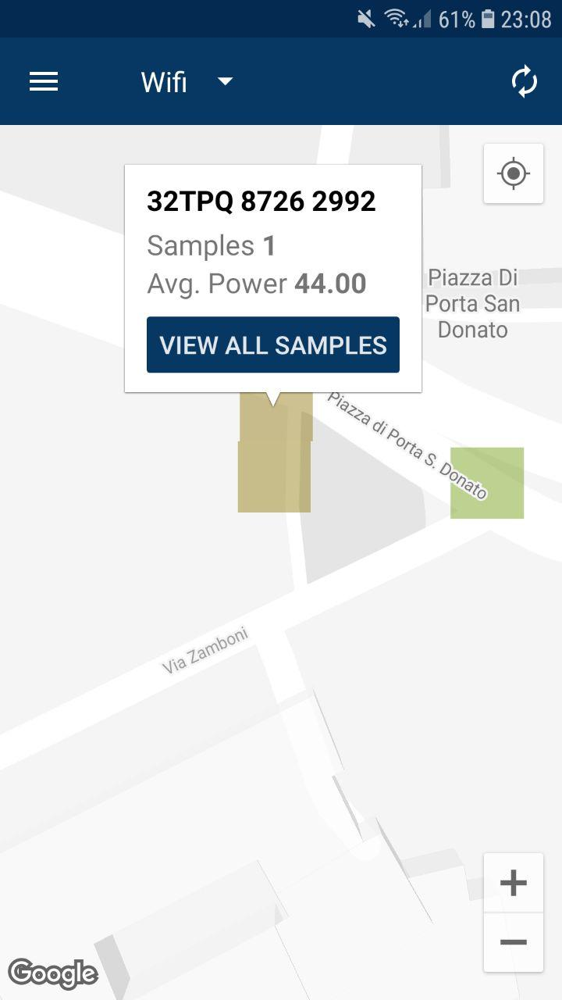
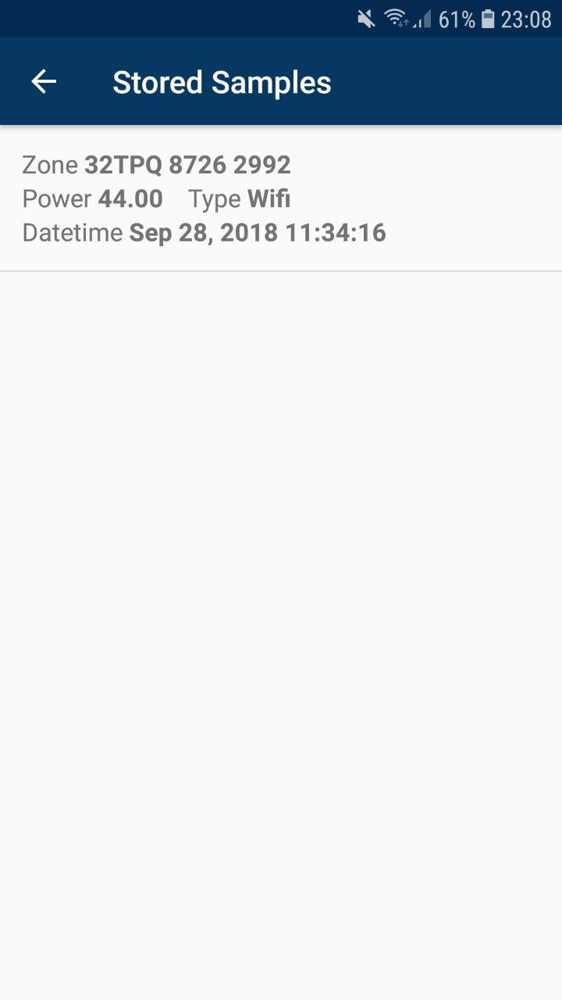

# Signal-Maps
Signal Maps is an Android application that was developed for [Mobile Applications course](http://cs.unibo.it/projects/android/2018/) at University of Bologna. This application allows users to capture and visualize the surrounding Wifi, UMTS and LTE signals. The signal caputure starts as the user turns on the location service on his/her device and starts moving. 
Captured data can be visualized either on a map or in a list. 
Map visualization represents signal samples as a 10x10 meters colored squares (a gradient from red to green indicating the maximum signal power for that area), positioned in the area of capture of that signal. 
List visualization represents the signal samples as list entries that include capture zone, signal power, signal type and capture date for each sample.

 
